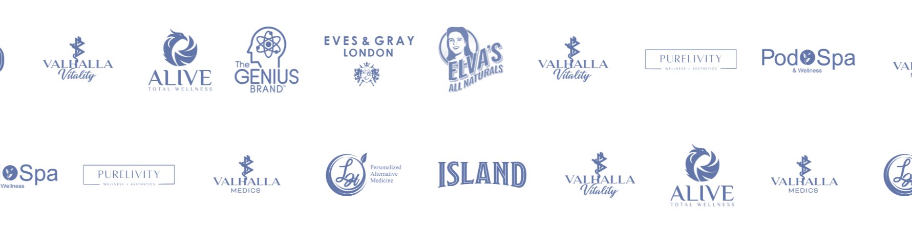
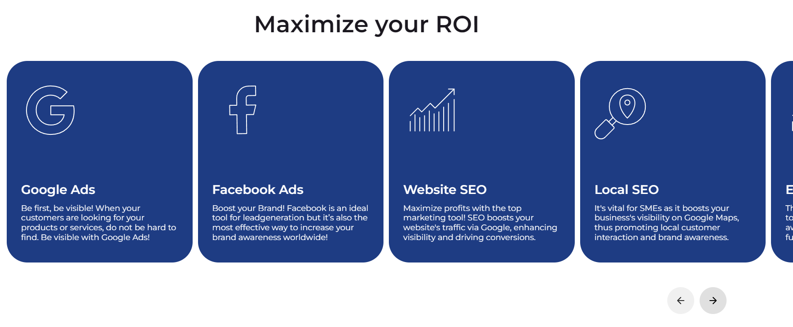
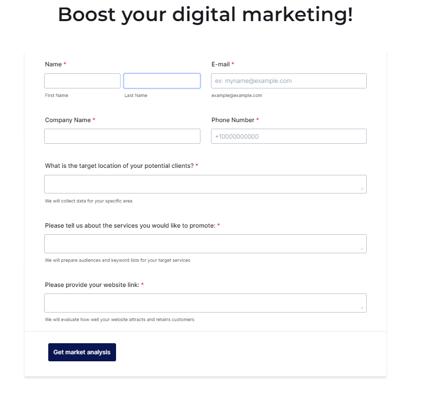
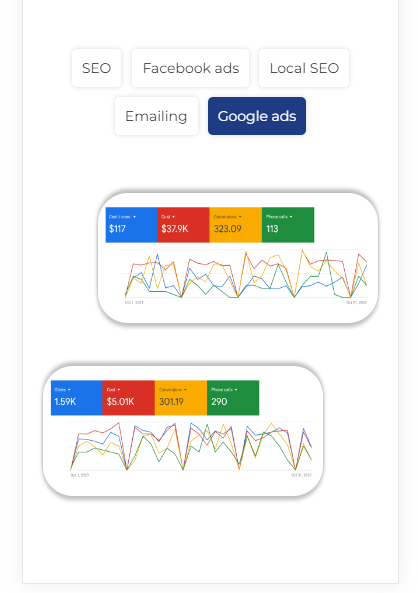

# Valhalla MS (real order)

[Here you can check it](https://artemuholkov.github.io/webugol-valhalla/)

---

I didn't have figma design for this project.
This landing page is 100% responsive for all types of screens.
I used HTML, CSS, JS in this project.

---

### What was interesting in this project:

1. Interesting view of main section. Swiper autosliding and depends on active slide correct tables appearing in the middle.

2. Autorolling logos. Animation infinite.

3. Slider created by swiperjs

4. Embed form from jotforms

5. Mobile view of main section custom built without any libraries, clean JS code

